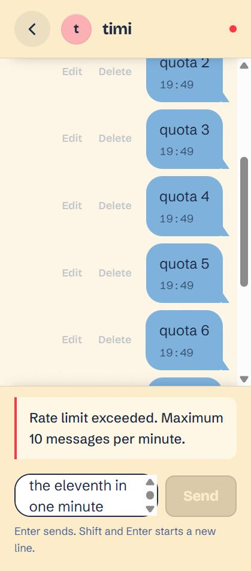

# MSG

A messenger for two people at a time. No groups, no feed — you need one
username to start, and messages land the moment they are sent.

FastAPI + Postgres on the back, React + Vite on the front, talking over REST
for history and a WebSocket for live delivery.

| Chats | Rate limit refusing the 11th message |
| --- | --- |
|  |  |

## Run it

```bash
cp backend/.env.example backend/.env   # then edit SECRET_KEY, DB_USER, DB_PASSWORD
docker compose --env-file ./backend/.env up --build
```

The `--env-file` is not optional. Compose interpolates `${DB_USER}` and friends
from its own environment, which `env_file:` inside a service does not feed, so
without it the `db` service refuses to start and says which variable is missing.

That brings up three services in order: `db` becomes healthy, `migrate` runs
`alembic upgrade head` and exits 0, then `app` starts. The API is on
`http://localhost:8000`, docs at `/docs`.

The frontend is not containerised — run it alongside:

```bash
cd frontend && npm install && npm run dev
```

### Development without Docker

```bash
cd backend && uv sync && uv run alembic upgrade head
uv run uvicorn main:app --reload
uv run pytest        # 23 tests
```

## Architecture

```
  browser
     |  REST: auth, history, edit, delete        WebSocket: send + live delivery
     v
  +--------------------------------------------------------------+
  |  FastAPI (app)                                                |
  |                                                               |
  |  routes/      auth, message, ws, health                       |
  |     |         thin: dependencies, status codes, serialisation |
  |     v                                                         |
  |  services/    the business rules live here                    |
  |     |         rate limit, edit window, who may touch what     |
  |     v                                                         |
  |  repository/  every query, and nothing else                   |
  |     |                                                         |
  |     v                                                         |
  |  models/      SQLAlchemy tables                               |
  +--------------------------------------------------------------+
     |
     v
  Postgres  (migrations applied by the one-shot `migrate` service)
```

Domain errors are raised by the service layer as subclasses of `DomainError`
and mapped to status codes once, in `main.py` — so a rule like "only the sender
may delete" is written in one place and answers correctly whether it was
reached over REST or over the socket.

**Sending goes over the WebSocket, not `POST /messages`.** The server stores the
message and echoes it to the receiver *and* back to the sender, so the client
only renders a bubble once it is really saved. The REST route still exists and
is what the tests and scripts use.

**The rate limit** is 10 messages per minute per sender, counted against an
append-only `message_send_events` log rather than the `messages` table — the
messages themselves can be deleted, and counting those let anyone delete their
way to a fresh allowance. The window is computed by the database so the app
container's clock cannot skew it, and the sender's row is locked for the length
of the check so two simultaneous sends cannot both pass.

**Logging in is throttled.** Three failed attempts for one username from one
address, and that pair is refused with `429` until the oldest of those
attempts ages out of the 15-minute window. The response carries `Retry-After`
with the measured number of seconds. The counter is
keyed on the pair rather than the username alone, so nobody can lock you out
of your own account by failing three times on purpose; a separate, higher
ceiling on the address itself (10) stops one machine spraying three guesses
each across many usernames. Getting the password right clears what was counted
against you, so two typos cost nothing. Counting and recording happen as one
step, under a Postgres advisory lock keyed on the address, *before* the
password is verified — all three of those matter. Counting and then recording
afterwards left a ~100ms gap in which simultaneous guesses all read zero: 30
at once got 17 through against a cap of 3. The lock makes it atomic across
replicas, which an in-process lock could not. And refusing before the verify
means a locked-out guesser cannot spend our CPU, since hashing is deliberately
expensive. Unknown usernames are
counted exactly like known ones, and the refusal reads the same either way, so
none of it reveals which accounts exist. All three numbers are settings
(`AUTH_MAX_ATTEMPTS`, `AUTH_MAX_ATTEMPTS_PER_IP`, `AUTH_LOCKOUT_MINUTES`).

## Known limitations

- **The WebSocket manager is in-memory and single-instance.** `core/ws_manager.py`
  keeps a dict of live sockets in the process, so a second replica would only
  reach the clients attached to itself. Scaling out needs Redis pub/sub (or
  similar) between instances.
- **`POST /messages` does not broadcast.** Only the WebSocket route tells the
  connection manager about a new message, so a message sent over REST reaches
  the recipient on their next load rather than immediately.
- **`UserService.register` is coupled to psycopg2 constraint names.** It reads
  `e.orig.diag.constraint_name` and compares against `users_username_key` /
  `users_email_key`, which are Postgres' default names for those unique
  constraints. Renaming a constraint, or moving to another driver or database,
  turns a clean 409 into a generic one.
- **The token travels in the WebSocket query string.** A browser cannot set an
  `Authorization` header on a WebSocket, so `/ws?token=…` is the usual
  workaround — but query strings are the part of a URL most likely to end up in
  access logs and proxy logs. Behind TLS it is not on the wire in clear, but it
  is still written down somewhere.
- **There is no blanket `except` in the WebSocket loop, deliberately.** It
  catches `WebSocketDisconnect`, bad JSON and `DomainError`, and lets anything
  else propagate so a real bug is loud instead of being swallowed into a socket
  that silently stops working. The `finally` still deregisters the connection.
- **The published database port is for development only.** `docker-compose.yaml`
  maps `5433:5432` so you can attach a client from the host. Do not publish it
  anywhere real — and note that if you already run Postgres on the host, both
  bind 5432 and which one a host client reaches is not defined.
- **Registration is not rate limited.** Login is; account creation is not, so
  one address can still create accounts in bulk.
- **The per-address ceiling can lock out a whole building.** Ten failures from
  one address blocks that address for the window, including people typing the
  right password. Behind campus NAT, carrier-grade NAT, or a load balancer,
  everyone shares one address and ten strangers' typos are enough. Raise
  `AUTH_MAX_ATTEMPTS_PER_IP`, or make sure the real client address reaches the
  app (below), before putting this anywhere with shared egress.
- **The Dockerfile `CMD` has no `--proxy-headers`.** That is fine under
  compose, where the app is reached directly, but on ECS or behind any load
  balancer `request.client.host` is the balancer's address, so every user
  lands in one throttle bucket. Add
  `--proxy-headers --forwarded-allow-ips=<balancer>` to the command there.
- **Usernames are case-sensitive.** `CaseTest` and `casetest` register as two
  different accounts, which is confusable in a messenger. The throttle keys
  match the lookup, so this is not a way around the limit — but if you ever
  normalise usernames, normalise the throttle keys in the same change or it
  becomes one.
- **Expired login attempts need an occasional sweep.** A login clears the
  expired rows for the address it is serving, so active addresses tidy up
  after themselves; `scripts/purge_auth_attempts.py` covers addresses that
  never come back.
- **The login throttle trusts `request.client.host`.** Behind a proxy that is
  the proxy's address, and every client would share one bucket. Run uvicorn
  with `--proxy-headers --forwarded-allow-ips=<proxy>` so it fills in the real
  address from a source it trusts. `X-Forwarded-For` is deliberately *not*
  read directly — a caller could set it per request and get a fresh allowance
  every time.

## Layout

```
.
├── Dockerfile              one image, used by both `migrate` and `app`
├── docker-compose.yaml     db → migrate → app
├── backend/                FastAPI service (see backend/README.md)
└── frontend/               React client (see frontend/README.md)
```
